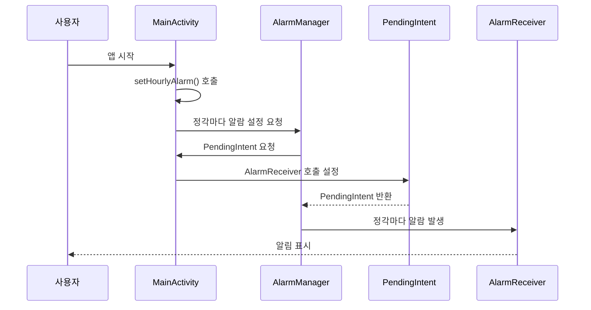

```
Exported with AIPRM https://www.aiprm.com by 문혜미 on 2023. 10. 6. 오전 8:49:44
```

---


**User:**
데이터베이스에는 학생 및 강좌 테이블이 있습니다. 최소 3개 강좌에 등록한 학생 목록을 가져오는 PostgreSQL 쿼리를 작성하세요.

번역결과

The database contains student and course tables. Write a PostgreSQL query to retrieve a list of students enrolled in at least three courses.

---

**ChatGPT:**
Certainly! Here are some software-related prompts that developers might use, translated into Korean:
<li><p>사용자 이름과 비밀번호를 입력받아 로그인 기능을 구현해주세요.
(Please implement a login feature that takes a username and password.)</p></li><li><p>데이터베이스에서 정보를 가져와서 사용자 인터페이스에 표시하는 코드를 작성해주세요.
(Please write code to fetch information from the database and display it on the user interface.)</p></li><li><p>사용자로부터 입력받은 숫자의 합을 계산하는 함수를 작성해주세요.
(Please write a function that calculates the sum of numbers entered by the user.)</p></li><li><p>웹페이지에 텍스트 박스와 버튼을 추가하여, 버튼을 클릭하면 텍스트 박스의 내용이 저장되는 기능을 만들어주세요.
(Please add a textbox and button to the web page, and create a feature that saves the content of the textbox when the button is clicked.)</p></li><li><p>리스트의 요소들을 오름차순으로 정렬하는 코드를 작성해주세요.
(Please write code that sorts the elements of a list in ascending order.)</p></li><li><p>파일에서 데이터를 읽어와서 그래프로 표시하는 코드를 작성해주세요.
(Please write code to read data from a file and display it as a graph.)</p></li><li><p>API를 호출하여 결과를 JSON 형식으로 파싱하는 코드를 작성해주세요.
(Please write code to call an API and parse the result in JSON format.)</p></li><li><p>사용자가 업로드한 이미지를 서버에 저장하는 코드를 작성해</p></li>

---

**User:**
정각마다 스트레칭을 유도하도록 알리는 앱을 만들고 싶어. 안드로이드 앱 코드 작성해

---

**ChatGPT:**
정각마다 스트레칭을 유도하는 안드로이드 앱을 만들기 위해서는 여러가지 기술적인 부분이 필요합니다. 여기에는 알람, 백그라운드 작업, 사용자에게 알림 전송 등이 포함됩니다.
간단한 예제로 AlarmManager를 사용하여 정각마다 알림을 보내는 코드를 제공하겠습니다:
<li><strong>AndroidManifest.xml</strong>에 권한 추가:</li>
```xml
<uses-permission android:name="android.permission.WAKE_LOCK" />
<uses-permission android:name="android.permission.RECEIVE_BOOT_COMPLETED" />

<application>
    ...
    <receiver android:name=".AlarmReceiver"/>
</application>
```
<li><strong>MainActivity.java</strong>에서 알람 설정:</li>
```java
import android.app.AlarmManager;
import android.app.PendingIntent;
import android.content.Intent;
import android.os.Bundle;
import android.widget.Toast;
import androidx.appcompat.app.AppCompatActivity;
import java.util.Calendar;

public class MainActivity extends AppCompatActivity {

    @Override
    protected void onCreate(Bundle savedInstanceState) {
        super.onCreate(savedInstanceState);
        setContentView(R.layout.activity_main);

        setHourlyAlarm();
    }

    private void setHourlyAlarm() {
        AlarmManager alarmManager = (AlarmManager) getSystemService(ALARM_SERVICE);
        Intent intent = new Intent(this, AlarmReceiver.class);
        PendingIntent pendingIntent = PendingIntent.getBroadcast(this, 0, intent, 0);

        // 정각마다 알람 설정
        Calendar calendar = Calendar.getInstance();
        calendar.add(Calendar.HOUR, 1);
        calendar.set(Calendar.MINUTE, 0);
        calendar.set(Calendar.SECOND, 0);

        alarmManager.setRepeating(AlarmManager.RTC_WAKEUP, calendar.getTimeInMillis(), AlarmManager.INTERVAL_HOUR, pendingIntent);
        Toast.makeText(this, "스트레칭 알림이 설정되었습니다.", Toast.LENGTH_SHORT).show();
    }
}
```
<li><strong>AlarmReceiver.java</strong>에서 알람 처리:</li>
```java
import android.content.BroadcastReceiver;
import android.content.Context;
import android.content.Intent;
import android.widget.Toast;

public class AlarmReceiver extends BroadcastReceiver {

    @Override
    public void onReceive(Context context, Intent intent) {
        Toast.makeText(context, "이제 스트레칭 시간입니다!", Toast.LENGTH_LONG).show();
        // 여기에 추가적으로 알림을 보내는 코드를 추가할 수 있습니다.
    }
}
```
위의 코드는 매우 간단한 예제입니다. 실제 앱에서는 사용자에게 더 나은 경험을 제공하기 위해 알림 스타일 변경, 알림 소리 설정, 스트레칭 가이드나 비디오 제공 등의 기능을 추가할 수 있습니다.

---

**User:**
위의 알람 앱을 Mermaid Flow Chart를 통해 UML로 만들어줘

---

**ChatGPT:**
Mermaid를 사용하여 위에서 설명한 간단한 알람 앱의 UML 플로우 차트를 작성하겠습니다.
```mermaid
graph TD
    A((MainActivity)) -->|setHourlyAlarm() 호출| B[AlarmManager 설정]
    B --> C[정각 시간 설정]
    B --> D[PendingIntent 설정]
    B --> E{AlarmManager 알람 시작}
    E -->|정각마다| F((AlarmReceiver))

    style A fill:#f9d,stroke:#333,stroke-width:2px
    style B fill:#ccd,stroke:#333,stroke-width:2px
    style C fill:#ccd,stroke:#333,stroke-width:2px
    style D fill:#ccd,stroke:#333,stroke-width:2px
    style E fill:#ccd,stroke:#333,stroke-width:2px
    style F fill:#f9d,stroke:#333,stroke-width:2px
```
이 플로우 차트는 다음과 같이 동작합니다:
<li><code>MainActivity</code>에서 <code>setHourlyAlarm()</code> 함수가 호출됩니다.</li><li><code>AlarmManager</code> 설정이 시작됩니다.</li><li>정각 시간을 설정합니다.</li><li><code>PendingIntent</code>를 설정하여 <code>AlarmReceiver</code>를 호출할 준비를 합니다.</li><li><code>AlarmManager</code>가 알람을 시작하며, 정각마다 <code>AlarmReceiver</code>를 호출합니다.</li>
이 UML 플로우 차트는 위에서 제공한 코드의 간단한 구조를 나타냅니다. 실제 앱 개발 시 여러 기능 및 세부 설정이 추가될 수 있으므로, 플로우 차트도 그에 따라 복잡해질 수 있습니다.

---

**User:**
위의 대답을 시퀀스 다이어그램으로 그려줘

---

**ChatGPT:**
시퀀스 다이어그램은 객체 간의 메시지 전달 순서와 상호 작용을 시각화합니다. 위의 알람 앱의 주요 상호 작용을 기반으로 시퀀스 다이어그램을 Mermaid로 작성하겠습니다.

이 시퀀스 다이어그램은 다음과 같은 순서로 상호 작용을 나타냅니다:
<li>사용자가 앱을 시작합니다.</li><li><code>MainActivity</code>에서 <code>setHourlyAlarm()</code> 함수가 호출됩니다.</li><li><code>MainActivity</code>는 <code>AlarmManager</code>에 정각마다 알람을 설정하도록 요청합니다.</li><li><code>AlarmManager</code>는 <code>MainActivity</code>에 <code>PendingIntent</code>를 요청합니다.</li><li><code>MainActivity</code>는 <code>PendingIntent</code>에 <code>AlarmReceiver</code>를 호출할 설정을 합니다.</li><li>설정이 완료된 <code>PendingIntent</code>가 <code>AlarmManager</code>에 반환됩니다.</li><li>정각마다 <code>AlarmManager</code>가 <code>AlarmReceiver</code>를 통해 알람을 발생시킵니다.</li><li><code>AlarmReceiver</code>는 사용자에게 알림을 표시합니다.</li>
이 시퀀스 다이어그램은 앱의 기본적인 알람 설정 및 알람 발생 메커니즘을 나타냅니다.

---

